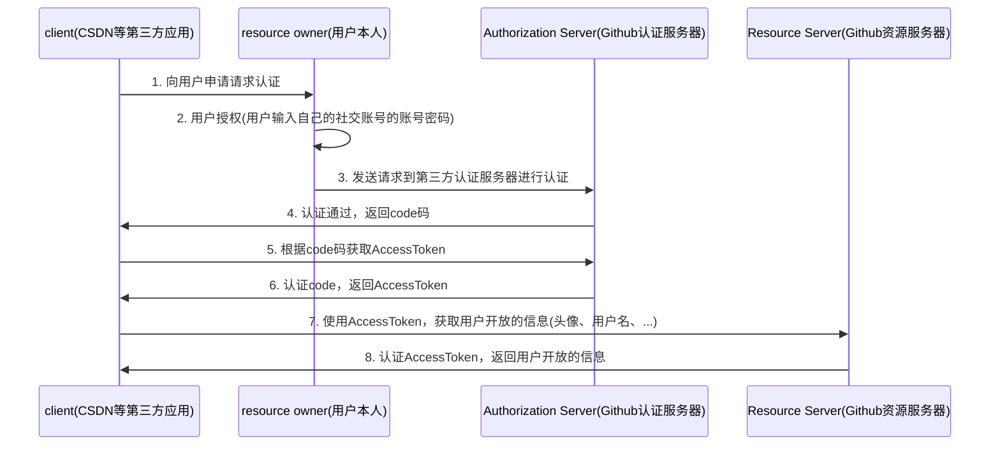
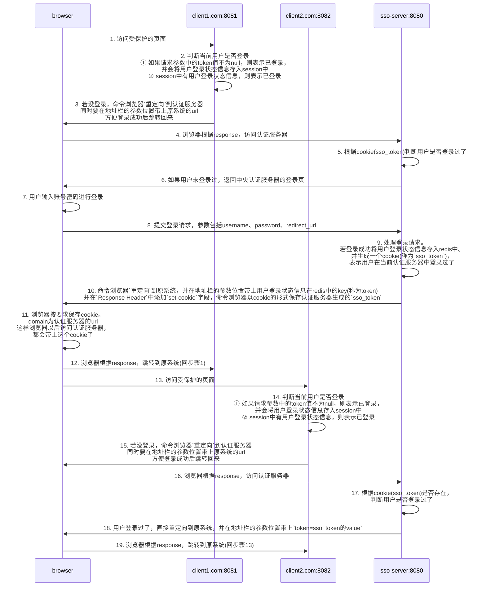

# 知识点

## 社交登录(OAuth2.0)流程

以`Github`为例

### 注意

1. 一个code码只能获取一次AccessToken
2. 一个用户的AccessToken在一段时间内不会发生变化，即使使用不同的code码重复获取

## Session在分布式下的问题

1. **跨域问题**: session有自己的作用域，只能在一个域名下有效，域名改变了session就会失效
2. **共享问题**: session保存在实例中，而分布式情况下有一个服务有多台实例

### 解决Session共享问题

1. **hash一致性**: 根据请求进行哈希映射，保证同一个请求永远都只会被负载均衡到同一台服务器上
2. **统一存储**: 将session存储在第三方中间件中(Redis、Database)，可以使用`Spring Session`

### 解决Session跨域问题

1. **子域共享**: 扩大session的作用域，那么当我们访问的路径在session作用域及其子域下时，session都有效

## 使用`Spring Session`

1. 引入`spring-session-data-redis`依赖
2. 在启动类上添加`@EnableRedisHttpSession`注解
3. 此后，所有向`HttpSession`中添加session的操作都会被filter转为向redis中添加session

## 单点登录(sso)

*一处登录，处处登录*  
在新浪官网(sina.com)登录过了，我们在微博(weibo.com)就不需要再次登录一遍，虽然是不同域名，但还是自动登录了

### 问题出现原因

之前我们使用`Spring Session`解决了Session的跨域问题，但那种跨域问题只能解决父域与子域之间(
gulimall.com和auth.gulimall.com)跨域问题，不能解决不同域名之间(taobao.com和tmall.com)
的跨域问题，因为我们不可能让某个Session的domain变成`com`

### 核心

1. 中央认证服务器
2. 其他**域名不同**的系统，这些系统在想要登录时会去中央认证服务器登录，登录成功后再跳转回自己系统
3. 所有系统只要有一个登录，其他都不用登录
4. 全系统统一一个cookie

### 流程图

下面对应基于`session`的`SSO`

#### 注意

其他系统在获取到token后可能还需要向中央认证服务器发送请求，根据token获取对应的用户信息(这和OAuth2.0类似)  
因为用户信息保存在中央认证服务器上，而不是其它系统上