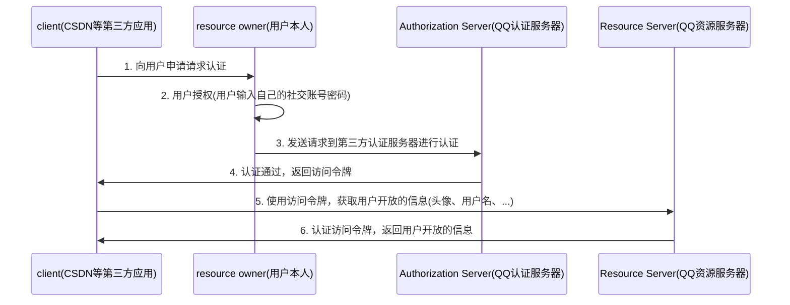

# 知识点

## 社交登录(OAuth2.0)流程

```mermaid
    sequenceDiagram
    participant A as client(CSDN等第三方应用)
    participant B as resource owner(用户本人)
    participant C as Authorization Server(QQ认证服务器)
    participant D as Resource Server(QQ资源服务器)
    A ->> B: 1. 向用户申请请求认证
    B ->> B: 2. 用户授权(用户输入自己的社交账号密码)
    B ->> C: 3. 发送请求到第三方认证服务器进行认证
    C ->> A: 4. 认证通过，返回访问令牌
    A ->> D: 5. 使用访问令牌，获取用户开放的信息(头像、用户名、...)
    D ->> A: 6. 认证访问令牌，返回用户开放的信息
```